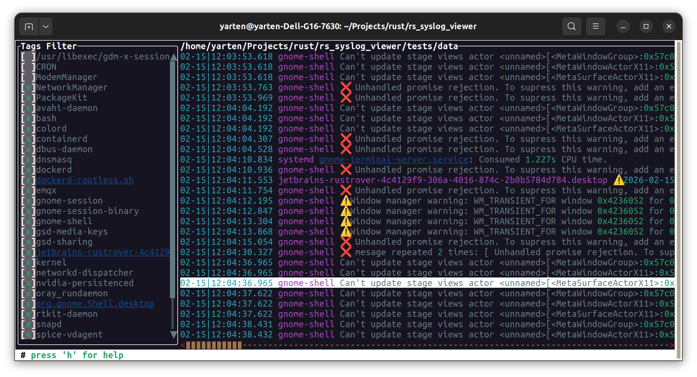
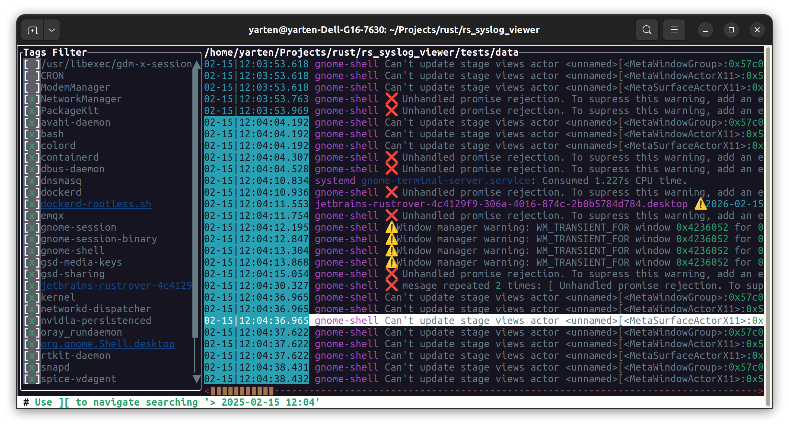
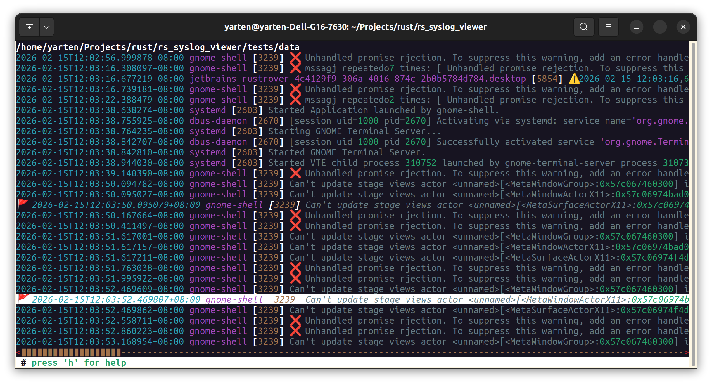

# Linux Syslog Viewer

## 简介

这是一个专门用于 linux syslog 日志查阅的终端可视化程序，也是我个人的 rust 编程练习作品。

## 特性

- 支持读取指定目录下的 syslog 日志，它们以 x.log, x.log.1 为命名风格，尾缀数字表示日志滚动，数字越大越旧；
- 支持同时读取多组日志（如 sys.log, kern.log 等）；
- 支持跟踪最新日志，响应旧日志的删除和滚动；
- 支持基于标签的日志过滤；
- 支持内容匹配搜索，以及时间戳模糊匹配搜索；
- 支持自定义打标记，并基于标记跳转日志；
- 丰富的展示风格。

## TODO

- 更加详细的测试与压测；
- 部分页面支持全屏化展示；
- 扩充高级指令功能，实现日志转存、快照等功能；
- 接入 CI/CD；

